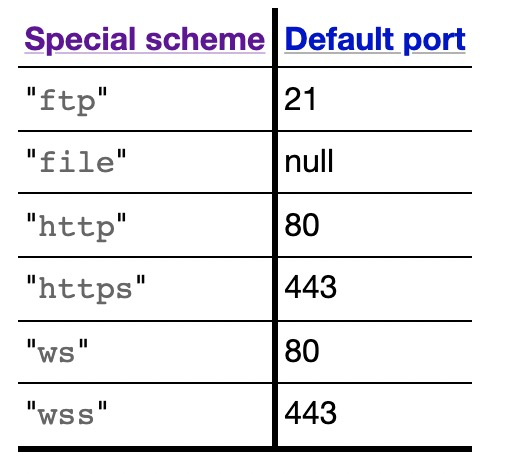
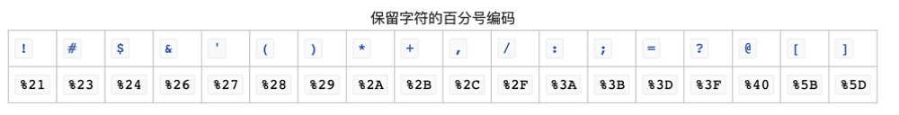

## URL
### 有效的URL
> URL是`绝对URL带有片段`和`相对URL带有片段`的一种
#### 绝对URL `absolute-URL`(是下面三个之一)
  1. [scheme]是特殊协议，但是不是`file`,后面跟一个`协议相对特殊URL`，`协议相对特殊URL`是`//` 加上[host:port],可选后跟`绝对路经`。
  2. `scheme`不是特殊协议，`协议`加`:`，后跟`相对URL`。
  3. `scheme`是`file`，加`:`，`协议相对文件URL`。
#### 相对URL `relative-URL`
  1. [scheme]是特殊协议，但是不是`file`,可选后跟以下之一：
      - `协议相对特殊URL`
      - `绝对路经`
      - `缺少协议的相对路经URL`
  2. `file`协议
      - `协议相对文件URL`
      - `绝对路经`
      - `路径绝对非Windows的文件的URL`
      - `缺少协议的相对路经URL`
  3. `非特殊协议`
      - `协议相对URL`
      - `绝对路经`
      - `缺少协议的相对路经URL`
#### 片段 `URL-fragment`:0个或者多个`URL单元`

### URL标注和解释
#### : 协议相关
  - `URL-scheme`: `URL协议`：包括`特殊协议`(不包括`file`)、`file`、其他。[协议列表](https://www.iana.org/assignments/uri-schemes/uri-schemes.xhtml)
  - `special scheme`: `特殊协议`：如下图：  

#### ：去除协议相关
  - `scheme-relative-file-URL`: `协议相对文件URL`：`//`后跟下面之一：
      - `有效的host`，可选后跟`路径绝对非Windows的文件的URL`
      - `绝对路经`。
  - `scheme-relative-special-URL`: `协议相对特殊URL`：`//`后跟`host:post`，可选后跟`绝对路经`
  - `path-relative-scheme-less-URL`: `缺少协议的相对路经URL`：是一个`相对路经`，但是开头不是`协议：`开头。
  - `scheme-relative-URL`: `协议相对URL`：`//`后跟`不透明主机和端口`，可选后跟`绝对路经`

#### : 主机相关
  - `opaque-host-and-port`: `不透明主机和端口`
#### : 路经相关
  - `path-absolute-URL`: `绝对路经`：是零个或多个`URL路经片段`以`/`相隔组成，并且不能以`/` 开头。
  - `path-relative-URL`: `相对路经`：是0个或多个`URL路经片段`以`/`相互分隔，并且不能以`/` 开头。
  - `URL-path-segment`:`URL路经片段`：？“
    - 0个或者多个`URL单元`构成，不包括`U+002F (/) `和`U+003F (?)`，也不包括`single-dot path segment`和`double-dot path segment`
    - `single-dot path segment`:`单点路径片段`：是`.`或者是他的ASCCI编码`%2e`
    - `double-dot path segment`: `双电路经片段`：是`..`或者是`.%2e`，`%2e.`，`%2e%2e`。

#### : URL单元
  - `URL units`: `URL单元`：包括`URL码点`和`百分比编码字节`。
    - ` URL code points`: `URL码点`：是ASCII字母，包括U+0021 (!), U+0024 ($), U+0026 (&), U+0027 ('), U+0028 LEFT PARENTHESIS, U+0029 RIGHT PARENTHESIS, U+002A (*), U+002B (+), U+002C (,), U+002D (-), U+002E (.), U+002F (/), U+003A (:), U+003B (;), U+003D (=), U+003F (?), U+0040 (@), U+005F (_), U+007E (~), 以及 U+00A0 到 U+10FFFD之间的，不包括`surrogates`(代理到别的位置，包括 U+D800~U+DFFF)，也不包括`noncharacter`(非字节，包括 U+FDD0 to U+FDEF)
    - `percent-encoded byte`: `百分比编码字节`：`%`加上2个`ASCII hex digits`(16进制数字)，用作保留字符的百分比编码，如图：

### host

#### 主机代表
  - 域名 `domain`: 一个非空ASCII字符串识别网络内的领域
    - `Domain Name System`: `DNS`设计目标
    - 

<!-- 参考W3C：https://url.spec.whatwg.org/#single-dot-path-segment>